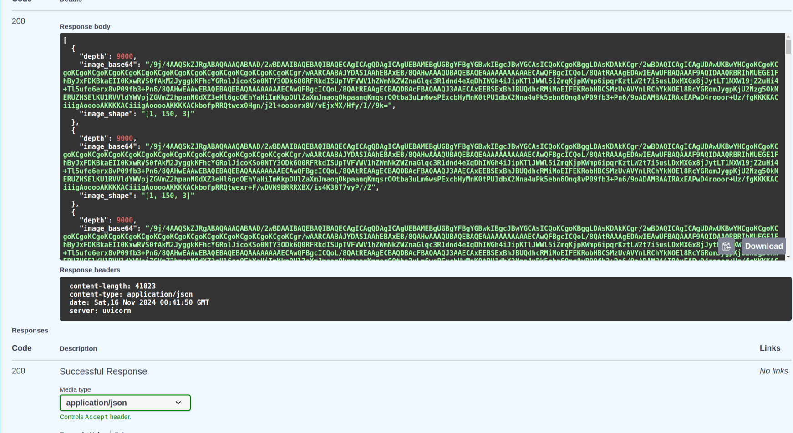

# Python  Technical Challenge

## Overview

The challenge focuses on processing image data, resizing it, applying a color map, and storing the results in a MySQL database. Additionally, an API is provided to retrieve image data based on specific depth ranges. The solution is implemented using Python, FastAPI, SQLAlchemy, and MySQL, with Docker orchestration for easy deployment.

### My understanding with Task  .
As we  have csv data  file that  contains images  data  .  we have  understand the images data and try to resize the images in 150 . and  then apply  the color map on this frame then store to 
database  and then i have to create api that will  give me response base on depath min and max  and last  dockerize the solution  so we can easliy deploy on any cloud . 

## Task Features

- **Image Resizing**: Resize image width from 200 to 150 pixels using bilinear interpolation. we  have used bilinear  becuase height of  image in 1 as we understand  from data .   
- **Color Mapping**: Apply a custom color map (`COLORMAP_JET`) to the resized images.  we  can apply  other color maping also like COLORMAP_plasma
- **API**: An endpoint to retrieve image frames based on depth ranges (`depth_min`, `depth_max`).
- **Database**: Store image data as Base64-encoded strings in a MySQL database.  we  can used MSSSQL or oracle or mongo alos ..  we choose  only demo purpose 
- **Dockerized**: The solution is containerized using Docker and Docker Compose, simplifying deployment.

## Technologies Used

- **Python 3.8.18+**
- **FastAPI**: For building the web API.
- **SQLAlchemy**: ORM for MySQL database interaction.
- **MySQL**: Relational database for storing image data.
- **OpenCV**: For image processing and color map application.
- **Docker**: For containerization of the application and database.
- **Pandas**: For CSV data manipulation.

## Setup & Installation

### Prerequisites

- Docker 24.0.5+ installed on your system.
- Python 3.8.18+ and the required Python packages.
## Project Structure

``` python_o_Innovation/
│
├── app/
│   ├── database_session.py         # Database connection and session management
│   ├── insert_csv_data_crud.py     # Logic for storing images in the database
│   ├── services.py                 # Image processing logic (resize and colormap)
│   ├── schemas.py                  # Pydantic models for request and response validation
│
├── data/
│   └── img.csv                     # Input CSV file with image data
│
├── main.py                         # FastAPI application entry point (moved to root folder)
├── Dockerfile                      # Dockerfile to build the FastAPI application container
├── docker-compose.yml              # Docker Compose configuration file
├── requirements.txt                # Python dependencies file
└── README.md                       # Project documentation (this file)

```
### Steps to Run the Project Locally

1. **Clone the Repository:**

   ```bash
   git clone https://github.com/zubairshahzadarain/python_O_Innovation.git
   move project directory 
   sudo docker-compose build
    sudo docker-compose up
    once  start  application will start on port 5000 
   http://localhost:5000/docs#/default/get_images_api_get_images_get
## Screenshots
**Runing Containers:**


**API Request and Response**





***images***


oringal image


resized  image


if there is any query you can conect at zubairshahzadarain@gmail.com   ....
